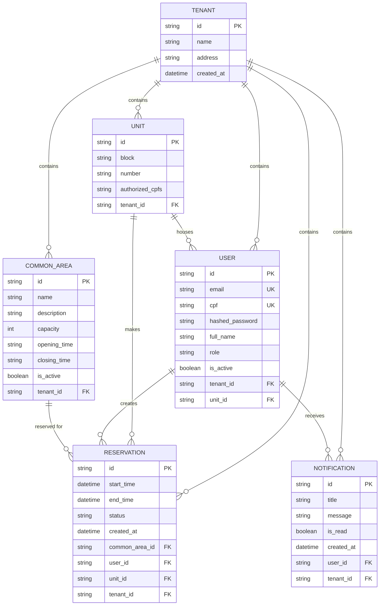

#  SindicoAI

> **Plataforma Inteligente de Gestão Condominial Multi-Tenant**

SindicoAI é uma solução moderna e escalável para gestão de condomínios, combinando automação, inteligência artificial e uma experiência de usuário premium. Desenvolvida com arquitetura multi-tenant, permite que múltiplos condomínios operem de forma isolada e segura em uma única infraestrutura.

---

##  Visão Geral

SindicoAI transforma a gestão condominial através de:

- **Inteligência Artificial**: Assistente virtual com RAG (Retrieval-Augmented Generation) para consultas sobre regimentos e documentos
- **Multi-Tenancy Robusto**: Isolamento completo de dados entre condomínios
- **Experiência Premium**: Interfaces web e mobile com design moderno e micro-interações
- **Performance**: Arquitetura assíncrona com PostgreSQL + pgvector
- **Segurança**: Autenticação JWT, refresh tokens e controle de acesso baseado em roles

---

## Principais Funcionalidades

### **Gestão de Reservas**
- Reserva de áreas comuns (piscina, salão de festas, churrasqueira, etc.)
- Validação automática de conflitos de horário
- Limite de reservas simultâneas por unidade
- Cancelamento com controle de permissões

###  **Gestão de Usuários e Unidades**
- Cadastro de moradores com validação de CPF
- Três níveis de acesso: **Admin** (síndico), **Resident** (morador), **Staff** (funcionário)
- CRUD completo de unidades habitacionais
- Importação em massa via CSV/Excel

###  **Sistema de Notificações**
- Notificações direcionadas (por usuário, unidade ou broadcast)
- Marcação de lidas/não lidas
- Filtros e gerenciamento individual

###  **Onboarding Simplificado**
- Cadastro de novo condomínio em um único endpoint
- Criação automática do primeiro admin (síndico)
- Login imediato após onboarding

###  **Autenticação e Segurança**
- Login OAuth2 compatível
- Access tokens (30 min) e Refresh tokens (7 dias)
- Rotação automática de refresh tokens
- Proteção de rotas com middleware

---

##  Arquitetura

### Stack Tecnológico

```
Backend:     FastAPI + SQLAlchemy (Async) + Pydantic
Database:    PostgreSQL 15 + pgvector (vetores para IA)
Cache/Queue: Redis
Auth:        JWT (python-jose) + bcrypt (passlib)
ORM:         SQLAlchemy 2.0 (async)
Migrations:  Alembic
IaC:         Terraform (AWS)
CI/CD:       GitHub Actions
```

### Estrutura do Projeto

```
SindicoAI/
├── backend/
│   ├── app/
│   │   ├── api/routes/          # Endpoints da API
│   │   │   ├── auth.py          # Login, refresh token
│   │   │   ├── onboarding.py    # Cadastro de condomínios
│   │   │   ├── users.py         # Gestão de usuários
│   │   │   ├── units.py         # CRUD de unidades
│   │   │   ├── common_areas.py  # Áreas comuns
│   │   │   ├── reservations.py  # Sistema de reservas
│   │   │   ├── notifications.py # Notificações
│   │   │   └── imports.py       # Importação CSV/Excel
│   │   ├── models/              # Modelos SQLAlchemy
│   │   ├── schemas/             # Schemas Pydantic
│   │   ├── services/            # Lógica de negócio
│   │   ├── core/                # Config, security, database
│   │   ├── dependencies/        # Injeção de dependências
│   │   └── utils/               # Funções auxiliares
│   ├── alembic/                 # Migrações do banco
│   ├── tests/                   # Testes automatizados
│   └── Dockerfile
├── infra/
│   └── terraform/               # Infraestrutura como código
├── .github/workflows/           # CI/CD pipelines
└── docker-compose.yml           # Ambiente de desenvolvimento
```

### Modelo de Dados



---

##  Quick Start

### Pré-requisitos

- Docker & Docker Compose
- Git

### Instalação

1. **Clone o repositório**
```bash
git clone https://github.com/fabiofilipe/SindicoAI.git
cd SindicoAI
```

2. **Configure variáveis de ambiente**
```bash
cp backend/.env.example backend/.env
# Edite backend/.env com suas configurações
```

3. **Inicie os serviços**
```bash
docker-compose up -d
```

4. **Execute as migrações**
```bash
docker-compose exec backend alembic upgrade head
```

5. **Acesse a API**
- API: http://localhost:8000
- Documentação interativa: http://localhost:8000/docs
- Health check: http://localhost:8000/health

---

##  Uso da API

### 1. Onboarding de Novo Condomínio

```bash
curl -X POST "http://localhost:8000/api/v1/public/onboarding" \
  -H "Content-Type: application/json" \
  -d '{
    "tenant_name": "Condomínio Exemplo",
    "tenant_address": "Rua Exemplo, 123",
    "admin_email": "sindico@exemplo.com",
    "admin_cpf": "12345678900",
    "admin_full_name": "João Silva",
    "admin_password": "senha_segura_123"
  }'
```

**Resposta:**
```json
{
  "message": "Condominium 'Condomínio Exemplo' created successfully!",
  "tenant_id": "uuid-tenant",
  "admin_user_id": "uuid-admin",
  "access_token": "eyJhbGciOiJIUzI1NiIsInR5cCI6IkpXVCJ9...",
  "token_type": "bearer"
}
```

### 2. Login

```bash
curl -X POST "http://localhost:8000/api/v1/auth/login" \
  -H "Content-Type: application/x-www-form-urlencoded" \
  -d "username=sindico@exemplo.com&password=senha_segura_123"
```

### 3. Criar Área Comum (Admin)

```bash
curl -X POST "http://localhost:8000/api/v1/common-areas" \
  -H "Authorization: Bearer YOUR_ACCESS_TOKEN" \
  -H "Content-Type: application/json" \
  -d '{
    "name": "Piscina",
    "description": "Piscina adulto e infantil",
    "capacity": 20,
    "opening_time": "08:00",
    "closing_time": "22:00"
  }'
```

### 4. Fazer Reserva (Morador)

```bash
curl -X POST "http://localhost:8000/api/v1/reservations" \
  -H "Authorization: Bearer YOUR_ACCESS_TOKEN" \
  -H "Content-Type: application/json" \
  -d '{
    "common_area_id": "uuid-area",
    "start_time": "2025-11-25T14:00:00Z",
    "end_time": "2025-11-25T18:00:00Z"
  }'
```

### 5. Importar Moradores (Admin)

```bash
curl -X POST "http://localhost:8000/api/v1/import/residents" \
  -H "Authorization: Bearer YOUR_ACCESS_TOKEN" \
  -F "file=@moradores.xlsx"
```

**Formato do Excel:**
| email | cpf | full_name | unit_number | block | password |
|-------|-----|-----------|-------------|-------|----------|
| morador@email.com | 12345678900 | Maria Silva | 101 | A | senha123 |

---

##  Controle de Acesso

### Roles e Permissões

| Funcionalidade | Admin | Resident | Staff |
|----------------|-------|----------|-------|
| Criar/editar áreas comuns | ✅ | ❌ | ❌ |
| Fazer reservas | ✅ | ✅ | ❌ |
| Cancelar própria reserva | ✅ | ✅ | ❌ |
| Cancelar reserva de outros | ✅ | ❌ | ❌ |
| Gerenciar usuários | ✅ | ❌ | ❌ |
| Importar dados | ✅ | ❌ | ❌ |
| Enviar notificações | ✅ | ❌ | ❌ |
| Ver próprias notificações | ✅ | ✅ | ✅ |

---

##  Roadmap

### ✅ Fase 1: Fundação (Concluída)
- [x] Setup Docker + Docker Compose
- [x] Modelagem de dados multi-tenant
- [x] Arquitetura limpa (Clean Architecture)
- [x] Autenticação JWT com refresh tokens
- [x] Migrações Alembic

### ✅ Fase 2: Backend Core (Concluída)
- [x] CRUD de áreas comuns
- [x] Sistema de reservas com validação de conflitos
- [x] Gestão de usuários e unidades
- [x] Sistema de notificações
- [x] Importação em massa (CSV/Excel)
- [x] Infraestrutura como código (Terraform)
- [x] CI/CD com GitHub Actions

###  Fase 3: Inteligência Artificial (Em Planejamento)
- [ ] Infraestrutura vetorial (pgvector)
- [ ] Pipeline de ingestão de documentos (PDFs)
- [ ] RAG (Retrieval-Augmented Generation)
- [ ] Assistente virtual para consultas sobre regimentos
- [ ] Framework de avaliação de qualidade (Ragas/DeepEval)

###  Fase 4: Frontend e Mobile (Futuro)
- [ ] Web Admin (React + Tailwind + Framer Motion)
- [ ] App do Morador (React Native)
- [ ] App do Funcionário (Offline-first)
- [ ] Design System premium com glassmorphism

###  Fase 5: Qualidade (Futuro)
- [ ] Testes de carga (Locust/k6)
- [ ] Testes de segurança (OWASP ZAP)
- [ ] Cobertura de testes > 80%

###  Fase 6: Produção (Futuro)
- [ ] Deploy em AWS via Terraform
- [ ] Monitoramento (Prometheus + Grafana)
- [ ] Logs centralizados
- [ ] Backups automatizados

---

##  Testes

```bash
# Executar testes
docker-compose exec backend pytest

# Com cobertura
docker-compose exec backend pytest --cov=app --cov-report=html

# Testes específicos
docker-compose exec backend pytest tests/test_reservation_conflicts.py
```

---

##  Desenvolvimento

### Comandos Úteis

```bash
# Ver logs
docker-compose logs -f backend

# Acessar shell do container
docker-compose exec backend bash

# Criar nova migration
docker-compose exec backend alembic revision --autogenerate -m "description"

# Aplicar migrations
docker-compose exec backend alembic upgrade head

# Reverter migration
docker-compose exec backend alembic downgrade -1

# Formatar código
docker-compose exec backend black app/
docker-compose exec backend isort app/
```

### Estrutura de Branches

- `main`: Código em produção
- `develop`: Desenvolvimento ativo
- `feature/*`: Novas funcionalidades
- `fix/*`: Correções de bugs

---

##  Contribuindo

1. Fork o projeto
2. Crie uma branch para sua feature (`git checkout -b feature/AmazingFeature`)
3. Commit suas mudanças (`git commit -m 'Add some AmazingFeature'`)
4. Push para a branch (`git push origin feature/AmazingFeature`)
5. Abra um Pull Request


---

##  Autor

**Fábio Filipe**
- GitHub: [@fabiofilipe](https://github.com/fabiofilipe)

---

<div align="center">

**[⬆ Voltar ao topo](#-sindicoai)**

Feito para transformar a gestão condominial

</div>
