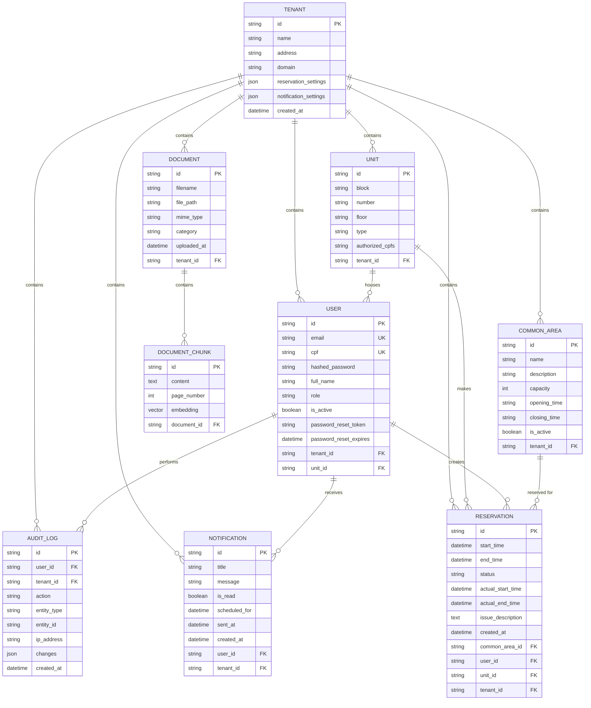

# SindicoAI

> Plataforma Inteligente de Gestão Condominial Multi-Tenant

SindicoAI é uma solução moderna e escalável para gestão de condomínios, combinando automação, inteligência artificial e uma experiência de usuário premium. Desenvolvida com arquitetura multi-tenant, permite que múltiplos condomínios operem de forma isolada e segura em uma única infraestrutura.

---

## Visão Geral

SindicoAI transforma a gestão condominial através de:

- **Inteligência Artificial**: Assistente virtual com RAG (Retrieval-Augmented Generation) para consultas sobre regimentos e documentos
- **Multi-Tenancy Robusto**: Isolamento completo de dados entre condomínios com Row-Level Security (RLS)
- **Experiência Premium**: Interfaces web com design Industrial Tech (glassmorphism + neon)
- **Quatro Portais Web**: Admin, Morador, Funcionário e Landing Page - cada um otimizado para seu público
- **Performance**: Arquitetura assíncrona com PostgreSQL + pgvector
- **Segurança**: Autenticação JWT, refresh tokens e controle de acesso baseado em roles (RBAC)
- **Tempo Real**: WebSocket para notificações instantâneas
- **Automação**: Agendamento de tarefas com APScheduler

---

## Principais Funcionalidades

### Gestão de Reservas
- Reserva de áreas comuns (piscina, salão de festas, churrasqueira, etc.)
- Validação automática de conflitos de horário
- Limite de reservas simultâneas por unidade
- Cancelamento com controle de permissões
- Registro de início, conclusão e problemas de reservas

### Gestão de Usuários e Unidades
- Cadastro de moradores com validação de CPF
- Três níveis de acesso: **Admin** (síndico), **Resident** (morador), **Staff** (funcionário)
- CRUD completo de unidades habitacionais com blocos, andares e tipos
- Importação em massa via CSV/Excel
- Atribuição de múltiplos residentes por unidade
- Gestão de CPFs autorizados para acesso

### Sistema de Notificações
- Notificações direcionadas (por usuário, unidade ou broadcast)
- Agendamento de notificações futuras com processamento automático
- Marcação de lidas/não lidas
- Entrega em tempo real via WebSocket
- Filtros e gerenciamento individual

### Assistente Virtual com IA
- Processamento de documentos (PDF, Excel) com extração de texto
- Embeddings vetoriais (768 dimensões) via Google Gemini
- RAG (Retrieval-Augmented Generation) para respostas contextualizadas
- Cache de respostas no Redis (TTL 1 hora)
- Rate limiting (50 requisições/dia por usuário)
- Estatísticas de uso e cache

### Onboarding Simplificado
- Cadastro de novo condomínio em um único endpoint
- Criação automática do primeiro admin (síndico)
- Login imediato após onboarding

### Autenticação e Segurança
- Login OAuth2 compatível
- Access tokens (30 min) e Refresh tokens (7 dias)
- Rotação automática de refresh tokens
- Proteção de rotas com middleware
- Sistema de recuperação de senha via email
- Auditoria completa de ações (Audit Logs)

### Relatórios e Análises
- Estatísticas de uso de áreas comuns
- Relatórios de reservas por período
- Métricas de utilização do sistema
- Logs de auditoria com rastreamento de IP e mudanças

---

## Arquitetura

### Stack Tecnológico

**Backend:**
```
Framework:   FastAPI 0.121.3 (Python 3.11+)
ORM:         SQLAlchemy 2.0.44 (async)
Validação:   Pydantic 2.12.5
Database:    PostgreSQL 15 + pgvector 0.4.1 (vetores para IA)
Cache:       Redis 7.1.0
Auth:        JWT (python-jose 3.5.0) + bcrypt (passlib 1.7.4)
IA:          Google Gemini 2.5-flash + RAG (Agno 3.0.5) + PostgreSQL/pgvector
Scheduler:   APScheduler 3.10.4
WebSocket:   FastAPI native WebSocket support
Migrations:  Alembic 1.17.2
Files:       pdfplumber 0.11.8, openpyxl 3.1.2, pandas 2.2.3
```

**Frontend:**
```
Framework:   React 19.2.0 + TypeScript
Build Tool:  Vite 7
Styling:     TailwindCSS 3.4.1 + Design System customizado
Routing:     React Router v6.22
State:       Context API + Zustand 4.5.2
Forms:       react-hook-form 7.51 + Zod 3.22.4 (Morador)
HTTP Client: Axios 1.6.7
Icons:       Lucide React 0.34+
Toasts:      react-hot-toast 2.6.0
Animations:  Framer Motion 11.0.8 (Landing, Morador)
Deploy:      Nginx Alpine (Docker)
```

**DevOps:**
```
Containers:  Docker + Docker Compose
Network:     sindicoai-network (bridge)
Volumes:     postgres_data (persistent)
```

### Estrutura do Projeto

```
SindicoAI/
├── backend/                     # Backend FastAPI
│   ├── app/
│   │   ├── api/routes/          # Endpoints da API (54 endpoints)
│   │   │   ├── auth.py          # Login, refresh token, password reset
│   │   │   ├── onboarding.py    # Cadastro de condomínios
│   │   │   ├── register.py      # Registro de novos usuários
│   │   │   ├── users.py         # Gestão de usuários
│   │   │   ├── units.py         # CRUD de unidades
│   │   │   ├── common_areas.py  # Áreas comuns
│   │   │   ├── reservations.py  # Sistema de reservas
│   │   │   ├── notifications.py # Notificações (CRUD + batch)
│   │   │   ├── documents.py     # Upload e gestão de documentos
│   │   │   ├── ai.py            # Assistente IA e RAG
│   │   │   ├── imports.py       # Importação CSV/Excel
│   │   │   ├── reports.py       # Relatórios e analytics
│   │   │   ├── audit.py         # Logs de auditoria
│   │   │   ├── settings.py      # Configurações do tenant
│   │   │   └── websocket.py     # WebSocket para notificações
│   │   ├── models/              # Modelos SQLAlchemy (ORM)
│   │   │   ├── base.py          # Tenant, User, Unit, CommonArea, Reservation, Notification
│   │   │   ├── document.py      # Document, DocumentChunk (pgvector)
│   │   │   └── audit.py         # AuditLog
│   │   ├── schemas/             # Schemas Pydantic (validação)
│   │   ├── services/            # Lógica de negócio
│   │   │   ├── rag_service.py   # RAG com Gemini
│   │   │   ├── document_service.py # Extração de texto
│   │   │   ├── cache_service.py # Redis caching
│   │   │   ├── reservation_service.py # Validação de conflitos
│   │   │   ├── import_service.py # Importação em massa
│   │   │   ├── scheduler.py     # APScheduler (notificações agendadas)
│   │   │   ├── websocket.py     # Connection manager
│   │   │   ├── audit.py         # Audit logging
│   │   │   └── file_validator.py # Validação de arquivos
│   │   ├── core/                # Config, security, database
│   │   │   ├── config.py        # Pydantic settings
│   │   │   ├── database.py      # Async engine + sessions
│   │   │   └── security.py      # JWT + password hashing
│   │   ├── dependencies/        # Injeção de dependências
│   │   │   └── auth.py          # get_current_user, require_admin
│   │   ├── middleware/          # Middlewares customizados
│   │   │   └── rate_limit.py    # Rate limiting
│   │   └── utils/               # Funções auxiliares
│   │       └── email.py         # Email notifications
│   ├── alembic/                 # Migrações do banco (10 migrations)
│   │   └── versions/            # Histórico de migrações
│   ├── tests/                   # Testes automatizados
│   │   ├── unit/                # Testes unitários
│   │   ├── integration/         # Testes de integração
│   │   ├── rag_evaluation/      # Testes de qualidade do RAG
│   │   ├── conftest.py          # Fixtures pytest
│   │   └── pytest.ini           # Configuração pytest
│   ├── samples/                 # Dados de exemplo
│   ├── scripts/                 # Scripts auxiliares
│   ├── uploads/                 # Arquivos enviados via API
│   ├── Dockerfile
│   ├── requirements.txt
│   └── .env.example
│
├── frontend/                    # Aplicações Frontend
│   ├── morador/                 # Portal do Morador (React)
│   │   ├── src/
│   │   │   ├── components/      # Componentes reutilizáveis
│   │   │   │   ├── auth/        # PrivateRoute
│   │   │   │   ├── forms/       # Input
│   │   │   │   ├── layout/      # MainLayout
│   │   │   │   └── ui/          # Button, HologramCard, Modal
│   │   │   ├── contexts/        # AuthContext
│   │   │   ├── hooks/           # useWebSocket, useToast
│   │   │   ├── pages/           # Páginas da aplicação
│   │   │   │   ├── assistant/   # Assistente Virtual (IA)
│   │   │   │   ├── auth/        # LoginPage, ForgotPassword, ResetPassword
│   │   │   │   ├── home/        # Dashboard
│   │   │   │   ├── notifications/ # Notificações
│   │   │   │   ├── profile/     # Perfil do usuário
│   │   │   │   └── reservations/ # Reservas de áreas
│   │   │   ├── services/        # API clients
│   │   │   ├── store/           # Zustand store
│   │   │   ├── types/           # Definições TypeScript
│   │   │   ├── App.tsx
│   │   │   └── main.tsx
│   │   ├── Dockerfile
│   │   ├── package.json
│   │   ├── vite.config.ts
│   │   └── tailwind.config.js
│   │
│   ├── funcionario/             # Portal do Funcionário (React)
│   │   ├── src/
│   │   │   ├── components/      # Componentes compartilhados
│   │   │   ├── contexts/        # AuthContext
│   │   │   ├── hooks/           # useWebSocket
│   │   │   ├── pages/
│   │   │   │   ├── auth/        # LoginPage, ForgotPassword, ResetPassword
│   │   │   │   ├── home/        # Dashboard operacional
│   │   │   │   ├── schedule/    # Agenda do dia
│   │   │   │   ├── notifications/ # Notificações
│   │   │   │   └── profile/     # Perfil
│   │   │   ├── services/        # API clients
│   │   │   ├── types/           # TypeScript types
│   │   │   └── App.tsx
│   │   ├── Dockerfile
│   │   └── package.json
│   │
│   ├── admin/                   # Portal Admin (React)
│   │   ├── src/
│   │   │   ├── components/      # Componentes reutilizáveis
│   │   │   │   ├── layout/      # DashboardLayout
│   │   │   │   └── ui/          # Button, Card, Modal, Table, etc
│   │   │   ├── contexts/        # AuthContext
│   │   │   ├── hooks/           # useWebSocket
│   │   │   ├── pages/
│   │   │   │   ├── auth/        # LoginPage, ForgotPassword, ResetPassword
│   │   │   │   ├── AuditLogsPage.tsx
│   │   │   │   ├── CommonAreasPage.tsx
│   │   │   │   ├── DashboardPage.tsx
│   │   │   │   ├── NotificationsPage.tsx
│   │   │   │   ├── ReportsPage.tsx
│   │   │   │   ├── SettingsPage.tsx
│   │   │   │   ├── UnitsPage.tsx
│   │   │   │   └── UsersPage.tsx
│   │   │   ├── services/        # API clients
│   │   │   ├── store/           # Zustand store
│   │   │   ├── types/           # TypeScript types
│   │   │   └── App.tsx
│   │   ├── Dockerfile
│   │   └── package.json
│   │
│   ├── landing/                 # Landing Page (React)
│   │   ├── src/
│   │   │   ├── components/      # Componentes com animações
│   │   │   ├── pages/           # HomePage
│   │   │   └── App.tsx
│   │   ├── Dockerfile
│   │   └── package.json
│   │
│   ├── Dockerfile               # Multi-stage build comum
│   └── nginx.conf               # Configuração Nginx
│
├── .github/workflows/           # CI/CD pipelines
│
├── docker-compose.yml           # Ambiente de desenvolvimento
├── PENDING_TASKS.md             # Roadmap e tarefas pendentes
├── PERMISSIONS.md               # Controle de acesso (RBAC)
└── README.md                    # Este arquivo
```

### Modelo de Dados


```mermaid
erDiagram
    TENANT ||--o{ USER : contains
    TENANT ||--o{ UNIT : contains
    TENANT ||--o{ COMMON_AREA : contains
    TENANT ||--o{ RESERVATION : contains
    TENANT ||--o{ NOTIFICATION : contains
    TENANT ||--o{ DOCUMENT : contains
    TENANT ||--o{ AUDIT_LOG : contains

    UNIT ||--o{ USER : houses
    UNIT ||--o{ RESERVATION : makes

    USER ||--o{ RESERVATION : creates
    USER ||--o{ NOTIFICATION : receives
    USER ||--o{ AUDIT_LOG : performs

    COMMON_AREA ||--o{ RESERVATION : "reserved for"

    DOCUMENT ||--o{ DOCUMENT_CHUNK : contains

    TENANT {
        string id PK
        string name
        string address
        string domain
        json reservation_settings
        json notification_settings
        datetime created_at
    }

    USER {
        string id PK
        string email UK
        string cpf UK
        string hashed_password
        string full_name
        string role
        boolean is_active
        string password_reset_token
        datetime password_reset_expires
        string tenant_id FK
        string unit_id FK
    }

    UNIT {
        string id PK
        string block
        string number
        string floor
        string type
        string authorized_cpfs
        string tenant_id FK
    }

    COMMON_AREA {
        string id PK
        string name
        string description
        int capacity
        string opening_time
        string closing_time
        boolean is_active
        string tenant_id FK
    }

    RESERVATION {
        string id PK
        datetime start_time
        datetime end_time
        string status
        datetime actual_start_time
        datetime actual_end_time
        text issue_description
        datetime created_at
        string common_area_id FK
        string user_id FK
        string unit_id FK
        string tenant_id FK
    }

    NOTIFICATION {
        string id PK
        string title
        string message
        boolean is_read
        datetime scheduled_for
        datetime sent_at
        datetime created_at
        string user_id FK
        string tenant_id FK
    }

    DOCUMENT {
        string id PK
        string filename
        string file_path
        string mime_type
        string category
        datetime uploaded_at
        string tenant_id FK
    }

    DOCUMENT_CHUNK {
        string id PK
        text content
        int page_number
        vector embedding
        string document_id FK
    }

    AUDIT_LOG {
        string id PK
        string user_id FK
        string tenant_id FK
        string action
        string entity_type
        string entity_id
        string ip_address
        json changes
        datetime created_at
    }
```

---

## Quick Start

### Pré-requisitos

- Docker & Docker Compose
- Git

### Instalação

1. **Clone o repositório**
```bash
git clone https://github.com/fabiofilipe/SindicoAI.git
cd SindicoAI
```

2. **Configure variáveis de ambiente**
```bash
cp backend/.env.example backend/.env
# Edite backend/.env com suas configurações
```

Variáveis principais:
```env
# PostgreSQL
POSTGRES_USER=fabiof
POSTGRES_PASSWORD=sua_senha_segura
POSTGRES_DB=sindicoai
DATABASE_URL=postgresql+asyncpg://fabiof:sua_senha@db:5432/sindicoai

# Redis
REDIS_URL=redis://redis:6379/0

# JWT
SECRET_KEY=gere_uma_chave_aleatoria_segura
ALGORITHM=HS256
ACCESS_TOKEN_EXPIRE_MINUTES=30
REFRESH_TOKEN_EXPIRE_DAYS=7

# Google Gemini
GOOGLE_API_KEY=sua_chave_api_gemini
```

3. **Inicie os serviços**
```bash
docker-compose up -d
```

4. **Execute as migrações**
```bash
docker-compose exec backend alembic upgrade head
```

5. **Acesse os serviços**

**Backend:**
- API: http://localhost:8000
- Documentação interativa: http://localhost:8000/docs
- Health check: http://localhost:8000/health

**Frontends:**
- Portal do Morador: http://localhost:3000
- Portal do Funcionário: http://localhost:3001
- Portal Admin: http://localhost:3002
- Landing Page: http://localhost:3003

**Credenciais de teste:**
| Portal | Email | Senha |
|--------|-------|-------|
| Morador | morador@prime.com | morador123 |
| Funcionário | funcionario@prime.com | func123 |
| Admin | admin@prime.com | admin123 |

---

## Uso da API

### Principais Endpoints

A API possui 54 endpoints distribuídos em 13 rotas principais:

#### Autenticação (`/api/v1/auth`)
- `POST /login` - Login com email e senha
- `POST /refresh` - Renovar access token
- `POST /forgot-password` - Solicitar reset de senha
- `POST /reset-password` - Redefinir senha com token

#### Onboarding Público (`/api/v1/public/onboarding`)
- `POST /` - Criar novo condomínio e primeiro admin

#### Registro Público (`/api/v1/public/register`)
- `POST /` - Registrar novo usuário (requer convite/aprovação)

#### Usuários (`/api/v1/users`)
- `GET /me` - Dados do usuário logado
- `GET /` - Listar usuários (Admin)
- `POST /` - Criar usuário (Admin)
- `PUT /{user_id}` - Atualizar usuário (Admin)
- `DELETE /{user_id}` - Deletar usuário (Admin)
- `POST /{user_id}/activate` - Ativar usuário (Admin)
- `POST /{user_id}/deactivate` - Desativar usuário (Admin)
- `POST /{user_id}/reset-password` - Forçar reset de senha (Admin)

#### Unidades (`/api/v1/units`)
- `GET /` - Listar unidades
- `POST /` - Criar unidade (Admin)
- `GET /{unit_id}` - Detalhes da unidade
- `PUT /{unit_id}` - Atualizar unidade (Admin)
- `DELETE /{unit_id}` - Deletar unidade (Admin)
- `POST /{unit_id}/residents/{user_id}` - Atribuir residente (Admin)
- `DELETE /{unit_id}/residents/{user_id}` - Remover residente (Admin)

#### Áreas Comuns (`/api/v1/common-areas`)
- `GET /` - Listar áreas comuns
- `POST /` - Criar área comum (Admin)
- `GET /{area_id}` - Detalhes da área
- `PUT /{area_id}` - Atualizar área (Admin)
- `DELETE /{area_id}` - Deletar área (Admin)

#### Reservas (`/api/v1/reservations`)
- `GET /` - Listar reservas
- `POST /` - Criar reserva
- `GET /{reservation_id}` - Detalhes da reserva
- `DELETE /{reservation_id}` - Cancelar reserva
- `POST /{reservation_id}/start` - Iniciar reserva (Staff)
- `POST /{reservation_id}/complete` - Finalizar reserva (Staff)
- `POST /{reservation_id}/report-issue` - Reportar problema (Staff)

#### Notificações (`/api/v1/notifications`)
- `GET /` - Listar minhas notificações
- `POST /batch` - Criar múltiplas notificações (Admin)
- `PUT /{notification_id}/read` - Marcar como lida
- `DELETE /{notification_id}` - Deletar notificação

#### Documentos (`/api/v1/documents`)
- `POST /upload` - Upload de documento (Admin)
- `GET /` - Listar documentos
- `DELETE /{document_id}` - Deletar documento (Admin)

#### Assistente IA (`/api/v1/ai`)
- `POST /chat` - Fazer pergunta ao assistente (rate limited)
- `GET /usage` - Ver uso diário
- `GET /cache/stats` - Estatísticas do cache (Admin)
- `DELETE /cache/clear` - Limpar cache (Admin)

#### Importação (`/api/v1/import`)
- `POST /units` - Importar unidades via CSV/Excel (Admin)
- `POST /residents` - Importar residentes via CSV/Excel (Admin)

#### Relatórios (`/api/v1/reports`)
- `GET /usage` - Relatório de uso de áreas comuns (Admin)
- `GET /reservations` - Estatísticas de reservas (Admin)

#### Auditoria (`/api/v1/audit`)
- `GET /logs` - Listar logs de auditoria (Admin)
- `GET /stats` - Estatísticas de auditoria (Admin)

#### Configurações (`/api/v1/settings`)
- `GET /` - Ver configurações do tenant
- `PUT /` - Atualizar configurações (Admin)

#### WebSocket (`/api/v1/ws/{user_id}`)
- `WS /` - Conexão WebSocket para notificações em tempo real

### Exemplos de Uso

#### 1. Onboarding de Novo Condomínio

```bash
curl -X POST "http://localhost:8000/api/v1/public/onboarding" \
  -H "Content-Type: application/json" \
  -d '{
    "tenant_name": "Condomínio Exemplo",
    "tenant_address": "Rua Exemplo, 123",
    "admin_email": "sindico@exemplo.com",
    "admin_cpf": "12345678900",
    "admin_full_name": "João Silva",
    "admin_password": "senha_segura_123"
  }'
```

**Resposta:**
```json
{
  "message": "Condominium 'Condomínio Exemplo' created successfully!",
  "tenant_id": "uuid-tenant",
  "admin_user_id": "uuid-admin",
  "access_token": "eyJhbGciOiJIUzI1NiIsInR5cCI6IkpXVCJ9...",
  "token_type": "bearer"
}
```

#### 2. Login

```bash
curl -X POST "http://localhost:8000/api/v1/auth/login" \
  -H "Content-Type: application/x-www-form-urlencoded" \
  -d "username=sindico@exemplo.com&password=senha_segura_123"
```

#### 3. Criar Área Comum (Admin)

```bash
curl -X POST "http://localhost:8000/api/v1/common-areas" \
  -H "Authorization: Bearer YOUR_ACCESS_TOKEN" \
  -H "Content-Type: application/json" \
  -d '{
    "name": "Piscina",
    "description": "Piscina adulto e infantil",
    "capacity": 20,
    "opening_time": "08:00",
    "closing_time": "22:00"
  }'
```

#### 4. Fazer Reserva (Morador)

```bash
curl -X POST "http://localhost:8000/api/v1/reservations" \
  -H "Authorization: Bearer YOUR_ACCESS_TOKEN" \
  -H "Content-Type: application/json" \
  -d '{
    "common_area_id": "uuid-area",
    "start_time": "2026-01-20T14:00:00Z",
    "end_time": "2026-01-20T18:00:00Z"
  }'
```

#### 5. Upload de Documento (Admin)

```bash
curl -X POST "http://localhost:8000/api/v1/documents/upload" \
  -H "Authorization: Bearer YOUR_ACCESS_TOKEN" \
  -F "file=@regimento_interno.pdf" \
  -F "category=regimentos"
```

#### 6. Chat com Assistente IA

```bash
curl -X POST "http://localhost:8000/api/v1/ai/chat" \
  -H "Authorization: Bearer YOUR_ACCESS_TOKEN" \
  -H "Content-Type: application/json" \
  -d '{
    "question": "Qual o horário de funcionamento da piscina?"
  }'
```

#### 7. Importar Moradores (Admin)

```bash
curl -X POST "http://localhost:8000/api/v1/import/residents" \
  -H "Authorization: Bearer YOUR_ACCESS_TOKEN" \
  -F "file=@moradores.xlsx"
```

**Formato do Excel:**
| email | cpf | full_name | unit_number | block | password |
|-------|-----|-----------|-------------|-------|----------|
| morador@email.com | 12345678900 | Maria Silva | 101 | A | senha123 |

---

## Controle de Acesso

### Roles e Permissões

| Funcionalidade | Admin | Resident | Staff |
|----------------|-------|----------|-------|
| Gerenciar configurações do tenant | Sim | Não | Não |
| Criar/editar áreas comuns | Sim | Não | Não |
| Fazer reservas | Sim | Sim | Não |
| Cancelar própria reserva | Sim | Sim | Não |
| Cancelar reserva de outros | Sim | Não | Não |
| Iniciar/finalizar reservas | Não | Não | Sim |
| Reportar problemas em reservas | Não | Não | Sim |
| Gerenciar usuários | Sim | Não | Não |
| Gerenciar unidades | Sim | Não | Não |
| Importar dados | Sim | Não | Não |
| Enviar notificações | Sim | Não | Não |
| Ver próprias notificações | Sim | Sim | Sim |
| Upload de documentos | Sim | Não | Não |
| Chat com IA | Sim | Sim | Não |
| Ver relatórios | Sim | Não | Não |
| Ver logs de auditoria | Sim | Não | Não |

### Multi-Tenancy e Isolamento

O isolamento de dados entre condomínios é garantido por:

1. **Tenant ID obrigatório**: Todos os modelos principais incluem `tenant_id`
2. **Filtros automáticos**: Queries sempre filtram por tenant do usuário autenticado
3. **Row-Level Security (RLS)**: Políticas de segurança no PostgreSQL
4. **Validação em múltiplas camadas**: Middleware, dependências e services
5. **WebSocket isolado**: Conexões agrupadas por tenant

---

## Design System: Industrial Tech

Os quatro portais frontend compartilham um design system consistente e moderno.

### Paleta de Cores

```
Base Colors (Dark Industrial):
  Coal:       #0B0C10 (Background principal)
  Coal Light: #1F2833 (Cards e elementos)
  Charcoal:   #2C3E50 (Acentos escuros)

Accent Colors (Tech Neon):
  Cyan:       #00FFF0 (Primary - títulos, CTAs)
  Tech Blue:  #0A84FF (Secundário - links, ícones)
  Purple:     #AF52DE (Terciário - highlights)

Status Colors:
  Terminal Green:  #30D158 (Sucesso, confirmações)
  Alert Orange:    #FF9F0A (Avisos)
  Critical Red:    #FF453A (Erros, exclusões)

Neutral:
  Metal Silver: #C7C7CC (Textos secundários)
  Metal Dark:   #48484A (Bordas, divisórias)
```

### Componentes Visuais

- **HologramCard**: Cards com efeito glassmorphism e bordas neon
- **Glow Effects**: Sombras luminosas em botões e inputs
- **Grid Pattern**: Background com padrão de grade tech
- **Scan Lines**: Animações sutis de linhas de varredura
- **Pulse Glow**: Animações de pulsação em elementos importantes
- **Smooth Transitions**: Framer Motion para animações fluidas (Landing e Morador)

### Tipografia

- **Headings**: Neon Cyan com text-shadow glow
- **Body**: Metal Silver sobre Coal backgrounds
- **Mono**: Para dados técnicos (CPF, datas, IDs)

---

## Testes

### Executar Testes

```bash
# Executar todos os testes
docker-compose exec backend pytest

# Com cobertura de código
docker-compose exec backend pytest --cov=app --cov-report=html

# Testes específicos
docker-compose exec backend pytest tests/unit/test_audit_service.py
docker-compose exec backend pytest tests/integration/test_auth.py

# Testes de RAG
docker-compose exec backend pytest tests/rag_evaluation/
```

### Estrutura de Testes

**Testes Unitários** (`tests/unit/`):
- `test_audit_service.py`: Serviço de auditoria
- `test_websocket_manager.py`: Gerenciador de WebSocket
- `test_scheduler.py`: Scheduler de notificações
- `test_gemini_api.py`: Integração com Google Gemini

**Testes de Integração** (`tests/integration/`):
- `test_auth.py`: Login, refresh token, logout
- `test_password_reset.py`: Fluxo completo de recuperação de senha
- `test_reservations.py`: Sistema de reservas e conflitos
- `test_audit_logs.py`: Logs de auditoria

**Testes de RAG** (`tests/rag_evaluation/`):
- `evaluate.py`: Framework de avaliação de qualidade do RAG
- Dataset de perguntas e respostas esperadas

### Cobertura de Testes

A cobertura atual de testes está em crescimento contínuo, com foco em:
- Endpoints críticos (autenticação, reservas, auditoria)
- Serviços core (RAG, WebSocket, Scheduler)
- Validação de regras de negócio

---

## Desenvolvimento

### Comandos Úteis

```bash
# Ver logs
docker-compose logs -f backend
docker-compose logs -f frontend-morador

# Acessar shell do container
docker-compose exec backend bash

# Criar nova migration
docker-compose exec backend alembic revision --autogenerate -m "description"

# Aplicar migrations
docker-compose exec backend alembic upgrade head

# Reverter migration
docker-compose exec backend alembic downgrade -1

# Formatar código (Python)
docker-compose exec backend black app/
docker-compose exec backend isort app/

# Rebuild de um serviço específico
docker-compose up -d --build backend
docker-compose up -d --build frontend-morador

# Limpar volumes e recomeçar
docker-compose down -v
docker-compose up -d
```

### Estrutura de Branches

- `main`: Código em produção (estável)
- `develop`: Desenvolvimento ativo (features em integração)
- `feature/*`: Novas funcionalidades
- `fix/*`: Correções de bugs
- `test/*`: Adição ou melhoria de testes

---

## Roadmap

### Fase 1: Fundação - Concluída
- [x] Setup Docker + Docker Compose
- [x] Modelagem de dados multi-tenant
- [x] Arquitetura limpa (Clean Architecture)
- [x] Autenticação JWT com refresh tokens
- [x] Migrações Alembic

### Fase 2: Backend Core - Concluída
- [x] CRUD de áreas comuns
- [x] Sistema de reservas com validação de conflitos
- [x] Gestão de usuários e unidades
- [x] Sistema de notificações
- [x] Importação em massa (CSV/Excel)
- [x] Sistema de auditoria
- [x] WebSocket para notificações em tempo real
- [x] Scheduler para tarefas assíncronas (APScheduler)
- [x] Sistema de recuperação de senha

### Fase 3: Inteligência Artificial - Concluída
- [x] Infraestrutura vetorial (pgvector)
- [x] Modelagem de dados (Document, DocumentChunk)
- [x] Pipeline de ingestão de documentos (PDFs com pdfplumber)
- [x] RAG (Retrieval-Augmented Generation) com Google Gemini
- [x] Assistente virtual para consultas sobre regimentos
- [x] Framework de avaliação de qualidade (evaluate.py)
- [x] Rate Limiting (50 requisições/dia)
- [x] Cache de respostas (Redis, TTL 1h)
- [x] Endpoints: `/ai/chat`, `/ai/usage`, `/ai/cache/stats`
- [x] Testes validados

### Fase 4: Frontend - Em Progresso (85% concluído)

**Concluído:**
- [x] **Web Admin** - Dashboard, Usuários, Unidades, Áreas Comuns, Notificações, Relatórios, Auditoria, Configurações
- [x] **Web Morador** - Dashboard, Reservas, Assistente IA, Notificações, Perfil
- [x] **Web Funcionário** - Dashboard, Agenda, Notificações, Perfil
- [x] **Landing Page** - Marketing page com animações Framer Motion
- [x] Design System Industrial Tech em todos os portais
- [x] Autenticação JWT com refresh token
- [x] WebSocket para notificações em tempo real
- [x] Sistema de recuperação de senha

**Em Desenvolvimento:**
- [ ] PWA (Service Workers, Web App Manifest)
- [ ] Push Notifications (FCM/Web Push API)
- [ ] Dark/Light mode toggle
- [ ] Melhorias de UX com Framer Motion
- [ ] Otimizações de performance (code splitting, lazy loading)

**Planejado:**
- [ ] Mobile Apps (React Native + Expo)
  - App do Morador (iOS + Android)
  - App do Funcionário (Offline-first)
  - Push notifications nativas
  - Biometria

### Fase 5: Qualidade - Futuro
- [ ] Testes de carga (Locust/k6)
- [ ] Testes de segurança (OWASP ZAP)
- [ ] Cobertura de testes > 80%
- [ ] Testes E2E (Playwright/Cypress)
- [ ] Performance monitoring (Sentry)

### Fase 6: Produção - Futuro
- [ ] Deploy em AWS via Terraform
- [ ] Monitoramento (Prometheus + Grafana)
- [ ] Logs centralizados (ELK Stack)
- [ ] Backups automatizados
- [ ] CI/CD completo (GitHub Actions)
- [ ] CDN para assets estáticos
- [ ] Rate limiting global (API Gateway)

---

## Segurança

### Práticas Implementadas

- **Autenticação JWT**: Tokens assinados com HS256
- **Refresh Tokens**: Rotação automática, expiração em 7 dias
- **Password Hashing**: bcrypt com salt automático
- **Password Reset**: Token único de uso único com expiração
- **Rate Limiting**: 50 requisições/dia para endpoint de IA
- **CORS**: Configurado para origens específicas
- **File Validation**: MIME type e tamanho de arquivo
- **SQL Injection**: Proteção via SQLAlchemy ORM
- **XSS Protection**: Headers de segurança no Nginx
- **Multi-Tenant Isolation**: RLS no PostgreSQL + validação em camadas
- **Audit Logs**: Rastreamento completo de ações sensíveis

### Recomendações para Produção

1. **Rotacionar credenciais**: `.env` contém senhas de desenvolvimento
2. **HTTPS obrigatório**: Configurar certificados SSL/TLS
3. **Rate limiting global**: Implementar em API Gateway ou Nginx
4. **Backup automatizado**: PostgreSQL e arquivos de upload
5. **Monitoramento de segurança**: Integração com SIEM
6. **Secrets management**: AWS Secrets Manager ou HashiCorp Vault
7. **Network policies**: Isolar serviços em VPC privada
8. **DDoS protection**: CloudFlare ou AWS Shield

---

## Contribuindo

1. Fork o projeto
2. Crie uma branch para sua feature (`git checkout -b feature/AmazingFeature`)
3. Commit suas mudanças (`git commit -m 'Add some AmazingFeature'`)
4. Push para a branch (`git push origin feature/AmazingFeature`)
5. Abra um Pull Request

### Diretrizes de Contribuição

- Mantenha o código limpo e bem documentado
- Escreva testes para novas funcionalidades
- Siga os padrões de código existentes (Black, isort para Python)
- Atualize a documentação quando necessário
- Use commits semânticos (feat:, fix:, docs:, etc.)

---

## Autor

**Fábio Filipe**
- GitHub: [@fabiofilipe](https://github.com/fabiofilipe)

---

**[Voltar ao topo](#sindicoai)**

Desenvolvido com foco em transformar a gestão condominial através da tecnologia.
