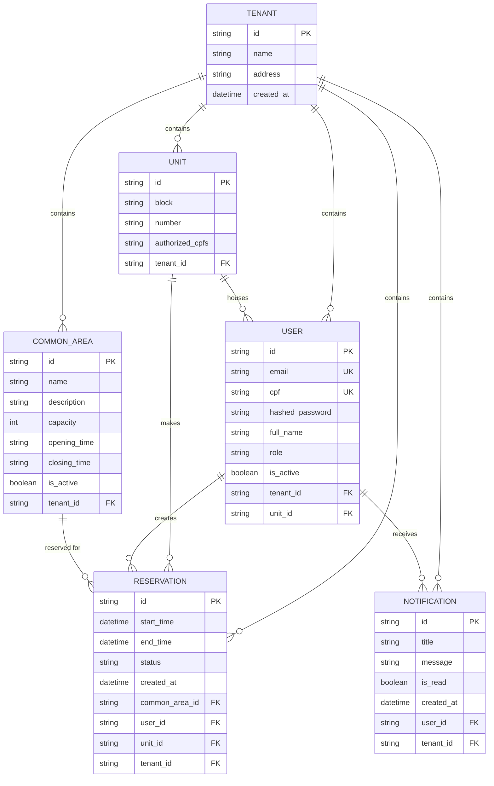

#  SindicoAI

> **Plataforma Inteligente de Gestão Condominial Multi-Tenant**

SindicoAI é uma solução moderna e escalável para gestão de condomínios, combinando automação, inteligência artificial e uma experiência de usuário premium. Desenvolvida com arquitetura multi-tenant, permite que múltiplos condomínios operem de forma isolada e segura em uma única infraestrutura.

---

##  Visão Geral

SindicoAI transforma a gestão condominial através de:

- **Inteligência Artificial**: Assistente virtual com RAG (Retrieval-Augmented Generation) para consultas sobre regimentos e documentos
- **Multi-Tenancy Robusto**: Isolamento completo de dados entre condomínios
- **Experiência Premium**: Interfaces web com design **Industrial Tech** (glassmorphism + neon)
- **Três Portais Web**: Admin, Morador e Funcionário - cada um otimizado para seu público
- **Performance**: Arquitetura assíncrona com PostgreSQL + pgvector
- **Segurança**: Autenticação JWT, refresh tokens e controle de acesso baseado em roles (RBAC)

---

## Principais Funcionalidades

### **Gestão de Reservas**
- Reserva de áreas comuns (piscina, salão de festas, churrasqueira, etc.)
- Validação automática de conflitos de horário
- Limite de reservas simultâneas por unidade
- Cancelamento com controle de permissões

###  **Gestão de Usuários e Unidades**
- Cadastro de moradores com validação de CPF
- Três níveis de acesso: **Admin** (síndico), **Resident** (morador), **Staff** (funcionário)
- CRUD completo de unidades habitacionais
- Importação em massa via CSV/Excel

###  **Sistema de Notificações**
- Notificações direcionadas (por usuário, unidade ou broadcast)
- Marcação de lidas/não lidas
- Filtros e gerenciamento individual

###  **Onboarding Simplificado**
- Cadastro de novo condomínio em um único endpoint
- Criação automática do primeiro admin (síndico)
- Login imediato após onboarding

###  **Autenticação e Segurança**
- Login OAuth2 compatível
- Access tokens (30 min) e Refresh tokens (7 dias)
- Rotação automática de refresh tokens
- Proteção de rotas com middleware

---

## 🎨 Design System: Industrial Tech

Os três portais frontend compartilham um design system consistente e moderno:

### Paleta de Cores
```
Base Colors (Dark Industrial):
  Coal:       #0B0C10 (Background principal)
  Coal Light: #1F2833 (Cards e elementos)
  Charcoal:   #2C3E50 (Acentos escuros)

Accent Colors (Tech Neon):
  Cyan:       #00FFF0 (Primary - títulos, CTAs)
  Tech Blue:  #0A84FF (Secundário - links, ícones)
  Purple:     #AF52DE (Terciário - highlights)

Status Colors:
  Terminal Green:  #30D158 (Sucesso, confirmações)
  Alert Orange:    #FF9F0A (Avisos)
  Critical Red:    #FF453A (Erros, exclusões)

Neutral:
  Metal Silver: #C7C7CC (Textos secundários)
  Metal Dark:   #48484A (Bordas, divisórias)
```

### Componentes Visuais
- **HologramCard**: Cards com efeito glassmorphism e bordas neon
- **Glow Effects**: Sombras luminosas em botões e inputs
- **Grid Pattern**: Background com padrão de grade tech
- **Scan Lines**: Animações sutis de linhas de varredura
- **Pulse Glow**: Animações de pulsação em elementos importantes

### Tipografia
- **Headings**: Neon Cyan com text-shadow glow
- **Body**: Metal Silver sobre Coal backgrounds
- **Mono**: Para dados técnicos (CPF, datas, IDs)

---

##  Arquitetura

### Stack Tecnológico

**Backend:**
```
Framework:   FastAPI (Python 3.11+)
ORM:         SQLAlchemy 2.0 (async)
Validação:   Pydantic v2
Database:    PostgreSQL 15 + pgvector (vetores para IA)
Cache:       Redis
Auth:        JWT (python-jose) + bcrypt (passlib)
IA:          Google Gemini + RAG (Retrieval-Augmented Generation)
Migrations:  Alembic
```

**Frontend:**
```
Framework:   React 19 + TypeScript
Build Tool:  Vite 7
Styling:     TailwindCSS 4 + Design System customizado
Routing:     React Router v7
State:       Context API + Zustand
HTTP Client: Axios com interceptors
Icons:       Lucide React
Deploy:      Nginx Alpine (Docker)
```

**DevOps:**
```
Containers:  Docker + Docker Compose
IaC:         Terraform (AWS)
CI/CD:       GitHub Actions
```

### Estrutura do Projeto

```
SindicoAI/
├── backend/                     # Backend FastAPI
│   ├── app/
│   │   ├── api/routes/          # Endpoints da API
│   │   │   ├── auth.py          # Login, refresh token
│   │   │   ├── onboarding.py    # Cadastro de condomínios
│   │   │   ├── register.py      # Registro de novos usuários
│   │   │   ├── users.py         # Gestão de usuários
│   │   │   ├── units.py         # CRUD de unidades
│   │   │   ├── common_areas.py  # Áreas comuns
│   │   │   ├── reservations.py  # Sistema de reservas
│   │   │   ├── notifications.py # Notificações
│   │   │   ├── documents.py     # Upload e gestão de documentos
│   │   │   ├── ai.py            # Assistente IA e RAG
│   │   │   └── imports.py       # Importação CSV/Excel
│   │   ├── models/              # Modelos SQLAlchemy (ORM)
│   │   ├── schemas/             # Schemas Pydantic (validação)
│   │   ├── services/            # Lógica de negócio
│   │   ├── core/                # Config, security, database
│   │   ├── dependencies/        # Injeção de dependências
│   │   ├── middleware/          # Middlewares customizados
│   │   └── utils/               # Funções auxiliares
│   ├── alembic/                 # Migrações do banco
│   │   └── versions/            # Histórico de migrações
│   ├── tests/                   # Testes automatizados
│   │   └── rag_evaluation/      # Testes de qualidade do RAG
│   ├── samples/                 # Dados de exemplo
│   ├── scripts/                 # Scripts auxiliares
│   ├── uploads/                 # Arquivos enviados via API
│   ├── Dockerfile
│   ├── requirements.txt
│   └── .env.example
│
├── frontend/                    # Aplicações Frontend
│   ├── morador/                 # Portal do Morador (React)
│   │   ├── src/
│   │   │   ├── components/      # Componentes reutilizáveis
│   │   │   │   ├── auth/        # PrivateRoute
│   │   │   │   ├── forms/       # Input
│   │   │   │   ├── layout/      # MainLayout
│   │   │   │   └── ui/          # Button, HologramCard, Modal
│   │   │   ├── contexts/        # AuthContext
│   │   │   ├── pages/           # Páginas da aplicação
│   │   │   │   ├── assistant/   # Assistente Virtual (IA)
│   │   │   │   ├── auth/        # LoginPage
│   │   │   │   ├── home/        # Dashboard
│   │   │   │   ├── notifications/ # Notificações
│   │   │   │   ├── profile/     # Perfil do usuário
│   │   │   │   └── reservations/ # Reservas de áreas
│   │   │   ├── services/        # API clients
│   │   │   ├── types/           # Definições TypeScript
│   │   │   ├── App.tsx
│   │   │   └── main.tsx
│   │   ├── Dockerfile
│   │   ├── package.json
│   │   ├── vite.config.ts
│   │   └── tailwind.config.js
│   │
│   ├── funcionario/             # Portal do Funcionário (React)
│   │   ├── src/
│   │   │   ├── components/      # Componentes compartilhados
│   │   │   ├── contexts/        # AuthContext
│   │   │   ├── pages/
│   │   │   │   ├── auth/        # LoginPage
│   │   │   │   ├── home/        # Dashboard operacional
│   │   │   │   ├── schedule/    # Agenda do dia
│   │   │   │   ├── notifications/ # Notificações
│   │   │   │   └── profile/     # Perfil
│   │   │   ├── services/        # API clients
│   │   │   ├── types/           # TypeScript types
│   │   │   └── App.tsx
│   │   ├── Dockerfile
│   │   └── package.json
│   │
│   ├── admin/                   # Portal Admin (React)
│   │   ├── src/
│   │   │   ├── components/      # Componentes reutilizáveis
│   │   │   │   ├── layout/      # DashboardLayout
│   │   │   │   └── ui/          # Button, Card, Modal, Table, etc
│   │   │   ├── contexts/        # AuthContext
│   │   │   ├── pages/
│   │   │   │   ├── LoginPage.tsx
│   │   │   │   ├── DashboardPage.tsx
│   │   │   │   └── UsersPage.tsx
│   │   │   ├── services/        # API clients
│   │   │   ├── types/           # TypeScript types

│   │   │   └── App.tsx
│   │   ├── Dockerfile
│   │   └── package.json
│   │
│   ├── Dockerfile               # Multi-stage build comum
│   └── nginx.conf               # Configuração Nginx
│
├── infra/
│   └── terraform/               # Infraestrutura como código (AWS)
│       ├── main.tf
│       ├── variables.tf
│       └── outputs.tf
│
├── .github/workflows/           # CI/CD pipelines
│   └── deploy.yml
│
├── docker-compose.yml           # Ambiente de desenvolvimento
├── PENDING_TASKS.md             # Roadmap e tarefas pendentes
├── PERMISSIONS.md               # Controle de acesso (RBAC)
└── README.md                    # Este arquivo
```

### Modelo de Dados


```mermaid
erDiagram
    TENANT ||--o{ USER : contains
    TENANT ||--o{ UNIT : contains
    TENANT ||--o{ COMMON_AREA : contains
    TENANT ||--o{ RESERVATION : contains
    TENANT ||--o{ NOTIFICATION : contains
    
    UNIT ||--o{ USER : houses
    UNIT ||--o{ RESERVATION : makes
    
    USER ||--o{ RESERVATION : creates
    USER ||--o{ NOTIFICATION : receives
    
    COMMON_AREA ||--o{ RESERVATION : "reserved for"
    
    TENANT {
        string id PK
        string name
        string address
        datetime created_at
    }
    
    USER {
        string id PK
        string email UK
        string cpf UK
        string hashed_password
        string full_name
        string role
        boolean is_active
        string tenant_id FK
        string unit_id FK
    }
    
    UNIT {
        string id PK
        string block
        string number
        string authorized_cpfs
        string tenant_id FK
    }
    
    COMMON_AREA {
        string id PK
        string name
        string description
        int capacity
        string opening_time
        string closing_time
        boolean is_active
        string tenant_id FK
    }
    
    RESERVATION {
        string id PK
        datetime start_time
        datetime end_time
        string status
        datetime created_at
        string common_area_id FK
        string user_id FK
        string unit_id FK
        string tenant_id FK
    }
    
    NOTIFICATION {
        string id PK
        string title
        string message
        boolean is_read
        datetime created_at
        string user_id FK
        string tenant_id FK
    }
```

---

##  Quick Start

### Pré-requisitos

- Docker & Docker Compose
- Git

### Instalação

1. **Clone o repositório**
```bash
git clone https://github.com/fabiofilipe/SindicoAI.git
cd SindicoAI
```

2. **Configure variáveis de ambiente**
```bash
cp backend/.env.example backend/.env
# Edite backend/.env com suas configurações
```

3. **Inicie os serviços**
```bash
docker-compose up -d
```

4. **Execute as migrações**
```bash
docker-compose exec backend alembic upgrade head
```

5. **Acesse os serviços**

**Backend:**
- API: http://localhost:8000
- Documentação interativa: http://localhost:8000/docs
- Health check: http://localhost:8000/health

**Frontends:**
- Portal do Morador: http://localhost:3000
- Portal do Funcionário: http://localhost:3001
- Portal Admin: http://localhost:3002

**Credenciais de teste:**
| Portal | Email | Senha |
|--------|-------|-------|
| Morador | morador@prime.com | morador123 |
| Funcionário | funcionario@prime.com | func123 |
| Admin | admin@prime.com | admin123 |

---

##  Uso da API

### 1. Onboarding de Novo Condomínio

```bash
curl -X POST "http://localhost:8000/api/v1/public/onboarding" \
  -H "Content-Type: application/json" \
  -d '{
    "tenant_name": "Condomínio Exemplo",
    "tenant_address": "Rua Exemplo, 123",
    "admin_email": "sindico@exemplo.com",
    "admin_cpf": "12345678900",
    "admin_full_name": "João Silva",
    "admin_password": "senha_segura_123"
  }'
```

**Resposta:**
```json
{
  "message": "Condominium 'Condomínio Exemplo' created successfully!",
  "tenant_id": "uuid-tenant",
  "admin_user_id": "uuid-admin",
  "access_token": "eyJhbGciOiJIUzI1NiIsInR5cCI6IkpXVCJ9...",
  "token_type": "bearer"
}
```

### 2. Login

```bash
curl -X POST "http://localhost:8000/api/v1/auth/login" \
  -H "Content-Type: application/x-www-form-urlencoded" \
  -d "username=sindico@exemplo.com&password=senha_segura_123"
```

### 3. Criar Área Comum (Admin)

```bash
curl -X POST "http://localhost:8000/api/v1/common-areas" \
  -H "Authorization: Bearer YOUR_ACCESS_TOKEN" \
  -H "Content-Type: application/json" \
  -d '{
    "name": "Piscina",
    "description": "Piscina adulto e infantil",
    "capacity": 20,
    "opening_time": "08:00",
    "closing_time": "22:00"
  }'
```

### 4. Fazer Reserva (Morador)

```bash
curl -X POST "http://localhost:8000/api/v1/reservations" \
  -H "Authorization: Bearer YOUR_ACCESS_TOKEN" \
  -H "Content-Type: application/json" \
  -d '{
    "common_area_id": "uuid-area",
    "start_time": "2025-11-25T14:00:00Z",
    "end_time": "2025-11-25T18:00:00Z"
  }'
```

### 5. Importar Moradores (Admin)

```bash
curl -X POST "http://localhost:8000/api/v1/import/residents" \
  -H "Authorization: Bearer YOUR_ACCESS_TOKEN" \
  -F "file=@moradores.xlsx"
```

**Formato do Excel:**
| email | cpf | full_name | unit_number | block | password |
|-------|-----|-----------|-------------|-------|----------|
| morador@email.com | 12345678900 | Maria Silva | 101 | A | senha123 |

---

##  Controle de Acesso

### Roles e Permissões

| Funcionalidade | Admin | Resident | Staff |
|----------------|-------|----------|-------|
| Criar/editar áreas comuns | ✅ | ❌ | ❌ |
| Fazer reservas | ✅ | ✅ | ❌ |
| Cancelar própria reserva | ✅ | ✅ | ❌ |
| Cancelar reserva de outros | ✅ | ❌ | ❌ |
| Gerenciar usuários | ✅ | ❌ | ❌ |
| Importar dados | ✅ | ❌ | ❌ |
| Enviar notificações | ✅ | ❌ | ❌ |
| Ver próprias notificações | ✅ | ✅ | ✅ |

---

##  Roadmap

### ✅ Fase 1: Fundação (Concluída)
- [x] Setup Docker + Docker Compose
- [x] Modelagem de dados multi-tenant
- [x] Arquitetura limpa (Clean Architecture)
- [x] Autenticação JWT com refresh tokens
- [x] Migrações Alembic

### ✅ Fase 2: Backend Core (Concluída)
- [x] CRUD de áreas comuns
- [x] Sistema de reservas com validação de conflitos
- [x] Gestão de usuários e unidades
- [x] Sistema de notificações
- [x] Importação em massa (CSV/Excel)
- [x] Infraestrutura como código (Terraform)
- [x] CI/CD com GitHub Actions

### ✅ Fase 3: Inteligência Artificial (Concluída)
- [x] Infraestrutura vetorial (pgvector)
- [x] Modelagem de dados (Document, DocumentChunk)
- [x] Pipeline de ingestão de documentos (PDFs com pdfplumber)
- [x] RAG (Retrieval-Augmented Generation) com Google Gemini
- [x] Assistente virtual para consultas sobre regimentos
- [x] Framework de avaliação de qualidade (evaluate.py)
- [x] Rate Limiting (50 requisições/dia)
- [x] Cache de respostas (Redis, TTL 1h)
- [x] Endpoints: `/ai/chat`, `/ai/usage`, `/ai/cache/stats`
- [x] Testes 100% validados

### 🔄 Fase 4: Frontend e Mobile (Em Progresso)

#### ✅ Concluído
- [x] **Web Admin** (React + Vite + TailwindCSS)
  - Design System Industrial Tech premium
  - Dashboard com métricas do sistema
  - Gestão completa de usuários (CRUD)
  - Autenticação JWT com refresh token
  - Interface glassmorphism e neon
  - **Porta:** http://localhost:3002
  - **Credenciais:** admin@prime.com / admin123

- [x] **Web Morador** (React + Vite + TailwindCSS)
  - Interface simplificada e responsiva
  - Dashboard com resumo de reservas e notificações
  - Sistema completo de reservas de áreas comuns
  - Calendário interativo
  - Chat com Assistente IA (RAG)
  - Notificações e perfil
  - **Porta:** http://localhost:3000
  - **Credenciais:** morador@prime.com / morador123

- [x] **Web Funcionário** (React + Vite + TailwindCSS)
  - Command Center dashboard
  - Agenda do dia
  - Gerenciamento de reservas
  - Notificações e perfil
  - **Porta:** http://localhost:3001
  - **Credenciais:** funcionario@prime.com / func123

#### 🚧 Em Desenvolvimento
- [ ] Completar funcionalidades do Admin
  - Gestão de Unidades
  - Gestão de Áreas Comuns
  - Gestão de Notificações
  - Upload de Documentos
  - Chat IA administrativo

- [ ] Expandir funcionalidades do Funcionário
  - Dashboard operacional completo
  - Calendário de manutenções
  - Gestão de ocorrências

#### 📱 Planejado
- [ ] Mobile Apps (React Native + Expo)
  - App do Morador (iOS + Android)
  - App do Funcionário (Offline-first)
  - Push notifications
  - Biometria

###  Fase 5: Qualidade (Futuro)
- [ ] Testes de carga (Locust/k6)
- [ ] Testes de segurança (OWASP ZAP)
- [ ] Cobertura de testes > 80%

###  Fase 6: Produção (Futuro)
- [ ] Deploy em AWS via Terraform
- [ ] Monitoramento (Prometheus + Grafana)
- [ ] Logs centralizados
- [ ] Backups automatizados

---

##  Testes

```bash
# Executar testes
docker-compose exec backend pytest

# Com cobertura
docker-compose exec backend pytest --cov=app --cov-report=html

# Testes específicos
docker-compose exec backend pytest tests/test_reservation_conflicts.py
```

---

##  Desenvolvimento

### Comandos Úteis

```bash
# Ver logs
docker-compose logs -f backend

# Acessar shell do container
docker-compose exec backend bash

# Criar nova migration
docker-compose exec backend alembic revision --autogenerate -m "description"

# Aplicar migrations
docker-compose exec backend alembic upgrade head

# Reverter migration
docker-compose exec backend alembic downgrade -1

# Formatar código
docker-compose exec backend black app/
docker-compose exec backend isort app/
```

### Estrutura de Branches

- `main`: Código em produção
- `develop`: Desenvolvimento ativo
- `feature/*`: Novas funcionalidades
- `fix/*`: Correções de bugs

---

##  Contribuindo

1. Fork o projeto
2. Crie uma branch para sua feature (`git checkout -b feature/AmazingFeature`)
3. Commit suas mudanças (`git commit -m 'Add some AmazingFeature'`)
4. Push para a branch (`git push origin feature/AmazingFeature`)
5. Abra um Pull Request


---

##  Autor

**Fábio Filipe**
- GitHub: [@fabiofilipe](https://github.com/fabiofilipe)

---

<div align="center">

**[⬆ Voltar ao topo](#-sindicoai)**

Feito para transformar a gestão condominial

</div>
